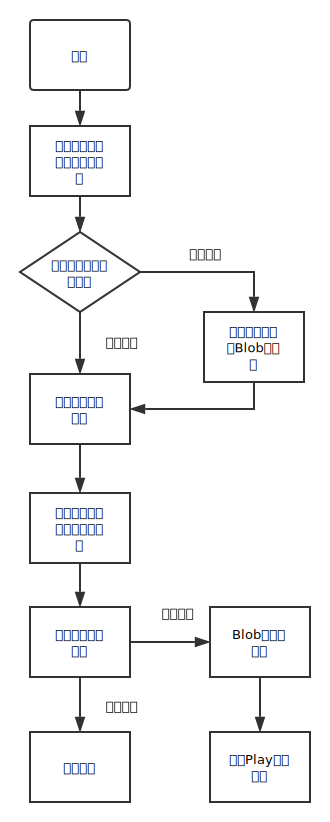

# JavaScript实现语音聊天

## 描述

程序在 [iamshaunjp](https://github.com/iamshaunjp/websockets-playlist/tree/lesson-5) 的群聊功能基础上利用webRTC技术，添加了语音群聊功能，在其他人键盘输入时，会出现类似微信的对方正在输入字样。demo：<https://biptedu.cn:4000/>

**使用的nodejs模块**

- `express`：创建一个web服务器
- `https`：创建https连接（局域网或者外网webRTC需要https连接，具体见[tutoril](https://www.html5rocks.com/en/tutorials/webrtc/basics/)）
- `socket.io`：客户端与服务端实时通信

**js文件**

- `chat.js`：实现按钮事件的注册、文本数据的发送等
- `record.js`：实现语音消息的录取、播放、发送等

## 结构图和流程图




## 创建https证书

在localhost中使用webRTC不需要使用https，但是在局域网或者外网使用webRTC，必须强制使用webRTC，这里采用自己生成证书供测试使用，具体生成方法和设置https方法[参考博客](http://blog.mgechev.com/2014/02/19/create-https-tls-ssl-application-with-express-nodejs/)：

- 生成自己签名的证书（有效期365天）
```
 openssl req -x509 -newkey rsa:2048 -keyout key.pem -out cert.pem -days 365
```
- 使用https连接的express，例子如下：
```javascript
  var fs = require('fs'),
    https = require('https'),
    express = require('express'),
    app = express();

    https.createServer({
      key: fs.readFileSync('key.pem'),
      cert: fs.readFileSync('cert.pem')
    }, app).listen(55555);

    app.get('/', function (req, res) {
      res.header('Content-type', 'text/html');
      return res.end('<h1>Hello, Secure World!</h1>');
    });
```